# 💰 Finly Finance  
### Plataforma de Gestão de Fluxo de Caixa

O **Finly Finance** é uma aplicação desenvolvida para facilitar o gerenciamento financeiro pessoal ou profissional. Com uma interface intuitiva, permite controlar contas, cartões, categorias e transações em um único lugar.

## Tecnologias
- **Angular** (v21.x)
- **TypeScript** (v5.9)
- **npm** (packageManager: npm@11.11.1)
---

## 🚀 Funcionalidades

- 🔐 Autenticação de usuários (login e registro)
- 🏦 Criação e gerenciamento de contas financeiras
- 💳 Controle de cartões
- 🗂️ Organização por categorias
- 💸 Registro de receitas e despesas
- 📊 Dashboard com visão geral do fluxo de caixa

---

## 📱 Telas da Aplicação

### 🔐 Login
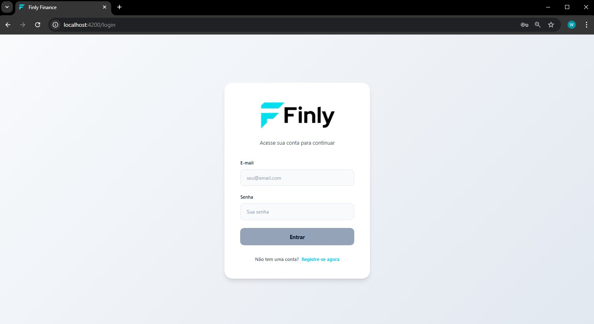

### 📝 Registro
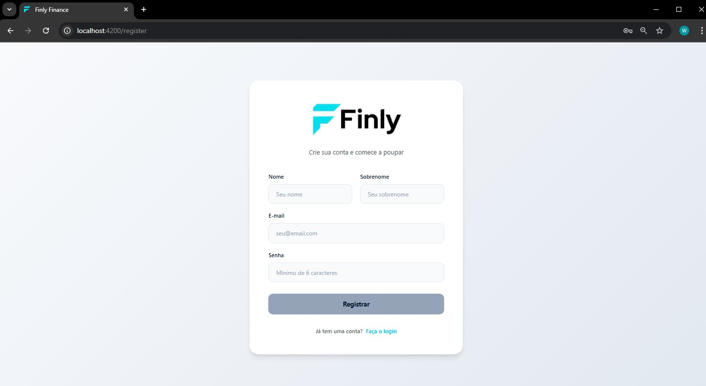

### 🏦 Criação de Conta
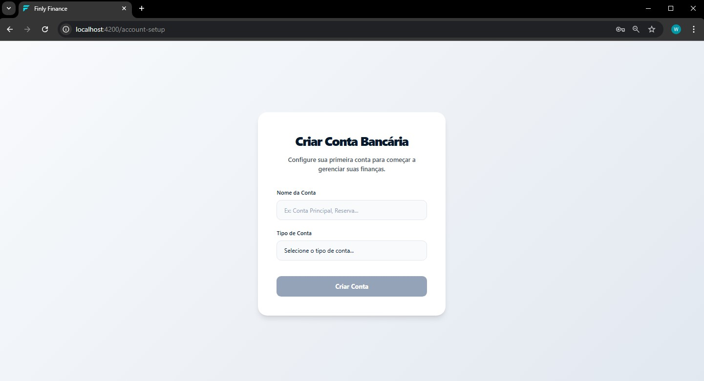

### 📂 Seleção de Contas
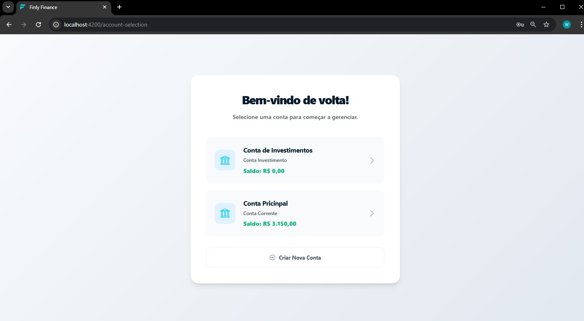

### 📊 Dashboard
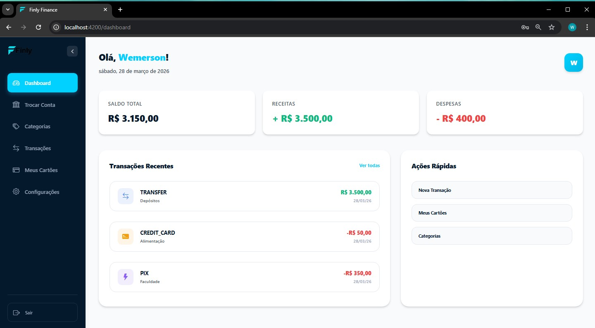

### 🗂️ Categorias
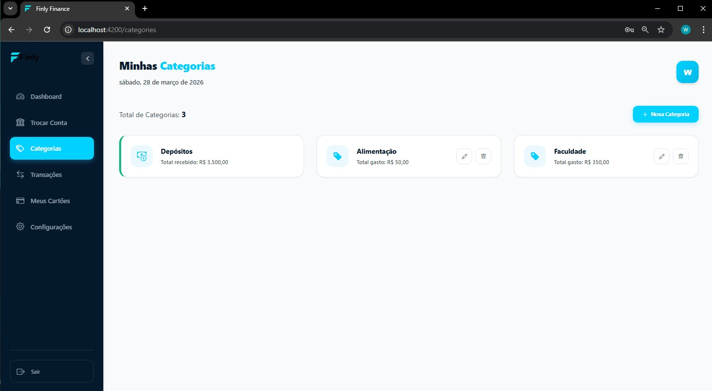

### ℹ️ Detalhes da Categoria
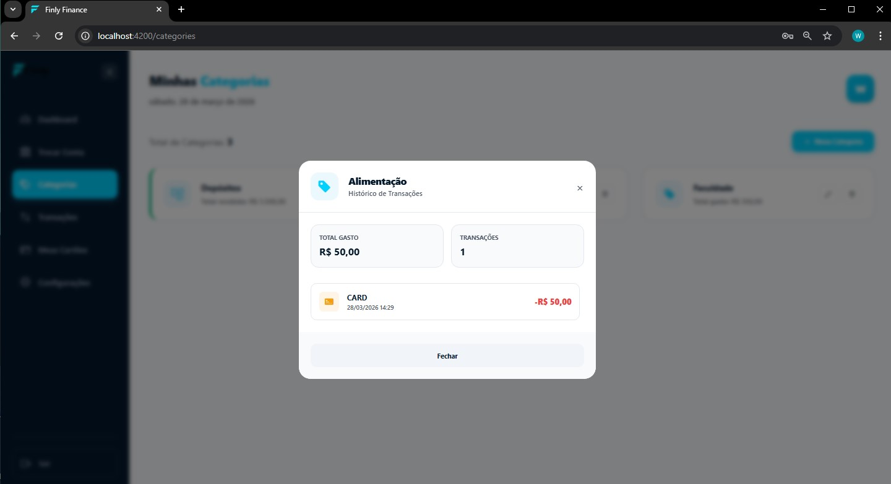

### 💳 Cartões
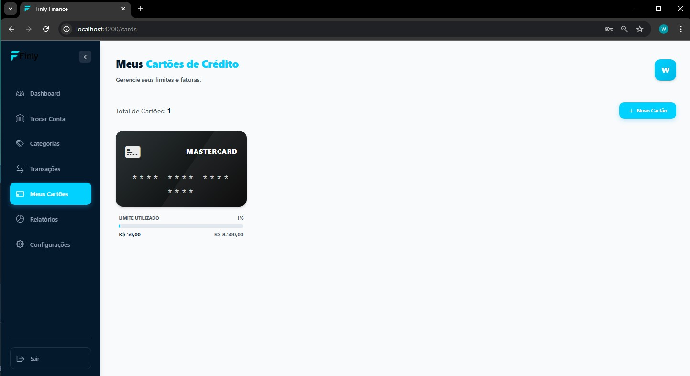

### ℹ️ Detalhes do Cartão
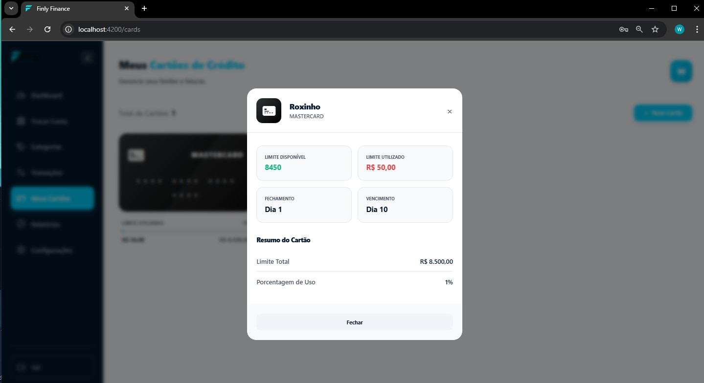

### 💸 Transações
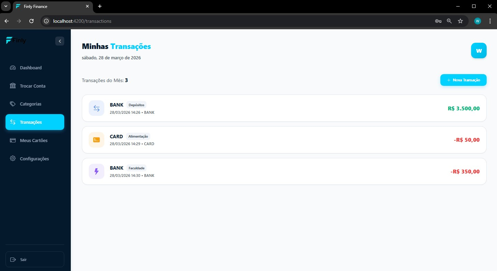

### ➕ Nova Transação
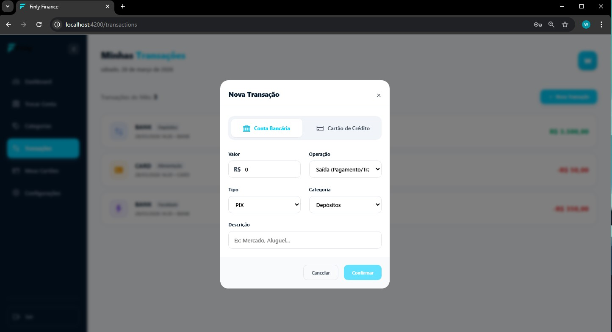
